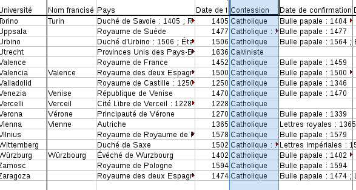
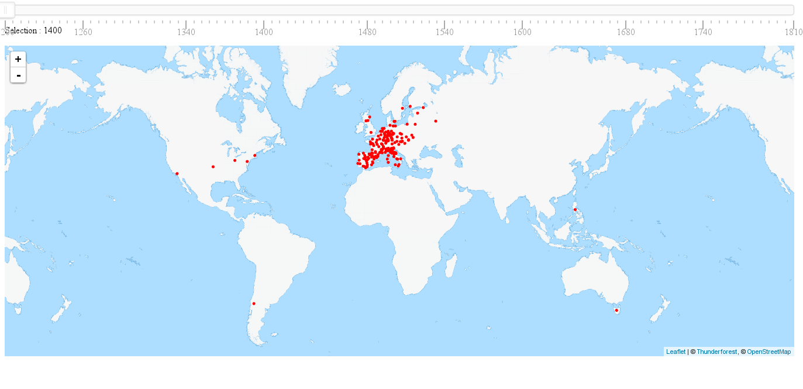
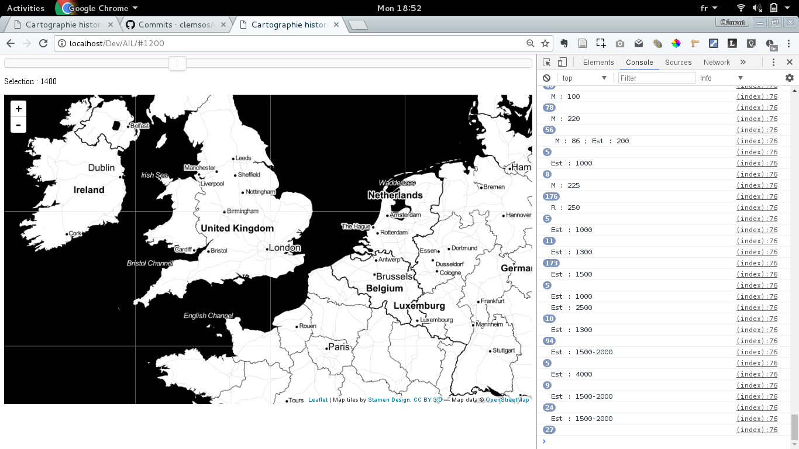
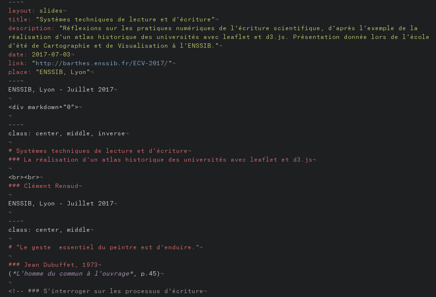

ENSSIB, Lyon - Juillet 2017

---
class: center, middle, inverse

# Systèmes techniques de lecture et d'écriture
### La réalisation d'un atlas historique des universités avec leaflet et d3.js

  
### Clément Renaud

ENSSIB, Lyon - Juillet 2017

---
class: center, middle

# "Le geste  essentiel du peintre est d'enduire."

### Jean Dubuffet, 1973
(*L'homme du commun à l'ouvrage*, p.45)

<!-- ### S'interroger sur les processus d'écriture

## Processus réflexif

* Influence sur la pensée
* Ecriture de la démonstration
* Outils
* Habitudes
* etc. -->

---
class:

# Atlas historique des universités

http://clementrenaud.com/carto-univ

.small[Travail mené à l'AIL, ENSSIB (Nov 2016)]
---
class:

# Lire... un jeu de données

### *Le mouvement universitaire médiéval en Europe*, Camille Ducrot, Mars 2014

**Définitions** (voir [article complet](./files/CDucrot- Universites.pdf))

> *Les universités* : "Les universités sont des institutions d'enseignement supérieur nées en Europe à partir du XIIIe siècle. L'usage de ce terme perdure jusqu'à aujourd'hui."

>  *Les matricules* : "Les matricules sont les inscriptions que les étudiants font à leur entrée à l'université."

> *Les Rotuli* : "Les rotuli (...) représentent donc le nombre de tous les membres de l'université sur une année, les profes-
seurs, les élèves mais aussi les personnes travaillant pour l'université"

---
# Reformuler... les données

.right-column[

### Négocier des abstractions

]

.left-column[
* Université
* Nom francisé
* Pays
* Date de fondation
* Date de confirmation
* Date de fermeture
* Réouverture
* Fermeture
* Réouverture
* Fermeture
* Confession
* Origine
* Créateur

----
* Le [jeu de données original](http://datapipes.okfnlabs.org/csv/html/?url=http://slides.clementrenaud.com/talks/ENSSIB-EcoleCartoVisu2017/files/CDucrot-Universites-mis-en-forme.csv#L17)
* Le [Journal de Bord](./files/Journal-EG-oct-2016.pdf) d'Eric
* La [version actuelle](http://datapipes.okfnlabs.org/csv/html/?url=http://clementrenaud.com/carto-univ/docs/Tout-Univ-religion-par-an.csv#L14) des données
]

---

# Observer... les problèmes de géocodage

* Voir le [Notebook](https://nbviewer.jupyter.org/github/clemsos/carto-univ/blob/gh-pages/notebooks/Carto%20des%20universit%C3%A9s.ipynb) détaillant les procédés de géocodage
* Notebok écrit avec [Jupyter](https://try.jupyter.org/) -- voir [Notebook ARC5](https://nbviewer.jupyter.org/github/clemsos/arc5/blob/master/notebooks/ARC5%20-%20M%C3%A9thodologie%20Finale.ipynb)
* Finalement, de nombreux ajustements ont été fait à la main...

---
class: inverse

# Ecrire... une représentation

* Les logs sur [Github](http://github.com/clemsos/carto-univ), utilisant [Git](https://fr.wikipedia.org/wiki/Git)
* Voir [la V0 sur bl.ocks](http://bl.ocks.org/clemsos/ca5b795ac730a555035cc781bb21fc5f) (et son code source) et le [code](https://gist.github.com/clemsos/ca5b795ac730a555035cc781bb21fc5f) -- ([offline](./versions/v0))

---
# Chercher... un point de vue

### Vers un atlas historique des universités
http://clementrenaud.com/carto-univ

---
class:

# (D)écrire la méthode

.right-column[

### Quelle organisation graphique pour la démonstration ?

]

.left-column[

#### Références multiples et de natures diverses

#### Quid du "code" ? Des figures ?

#### Systèmes techniques qui ont produit les sources

#### Négocier, itérer, tester

#### Construction de représentations

#### Recherche de point de vue

]

---
class: middle, center

## Merci !

### Clément Renaud

clement.renaud@epfl.ch

@clemsos
