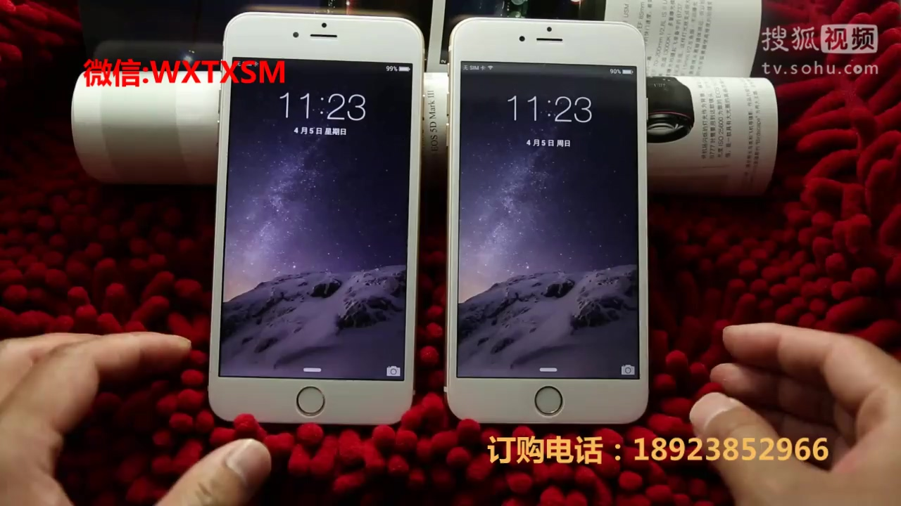

EPFL - 23 Novembre 2016

Clément Renaud / http://clementrenaud.com

---
class: center, middle, inverse

# “Mass makerspaces” : un projet de renouveau urbain par l’innovation technologique en Chine

### Going East - EPFL

Clément Renaud - 23 Novembre 2016

http://clementrenaud.com

---
class: inverse, center, middle, cover

# Towards the "Fab City"

---
class: inverse
background-image: url(img/space-software.png)

---

name: title
class: center, inverse
background-image: url(../pspe/img/opimpuc-header.jpg)

# Créativité, innovation et production

## Where does technology emerge ?

 
 
 
 
 
 
 
 
 
 

How does innovation take place ?
---

class: inverse
background-image: url(img/maker.jpg)

# Les tiers-lieux ?

### Mutualisation des ressources, apprentissage, technologie...

---
class: inverse
background-image: url(img/betahaus-Barcelona.jpg)

# Coworking space
Beta Haus, Barcelona

---
class: inverse
background-image: url(img/noisebridge-workshop.jpg)

# Hackerspace

Noisebridge, San Francisco

---
class: inverse
background-image: url(img/articlect-toulouse.jpg)

# Fablabs

Artilect, Toulouse

---
background-image: url(img/kohtala-bosque-figure1.png)

et leurs nombreux hybrides !

(Bosque, 2016)

---
class: inverse, center, middle, cover

# China : the post-danwei city

---

class: inverse
background-image: url(img/mao-factory.jpg)

# Danwei and the factory-city

---
class: inverse
background-image: url(img/china-engineer.jpg)

# China : "The Dream of Red Engineers"

---
class: inverse
background-image: url(img/Electronics_factory_in_Shenzhen-min.jpg)

# The "Made in China" era

---
background-image: url(img/made-in-china-2025.jpg)
class: inverse

# *Made in China 2025*

---
class: inverse
background-image: url(img/chuangke.jpg)

# 创客 chuangke

---
background-image: url(img/LiKeqiang-Seed.png)

---
class: inverse, cover, middle, center

# Etudes de cas

## Shanghai
## Nanjing
## Shenzhen

---
class: inverse, cover, middle, center
background-image: url(img/shanghai.jpg)

# Shanghai

---
class: inverse, cover, middle, center
# Shanghai's scales

.col-one-half[]
.col-one-half[]

---
class: inverse
background-image: url(img/creativeparks.jpg)

# Creative Clusters ?
### 12th Shanghai Urban Plan 2006-2015

.footnote[
- CICs in Shanghai have largely fail to deliver
services to SMEs
- Large companies have emerged (mostly state-owned)
(Zhen &Chan, 2014)
- No "creative class" has emerged (O' Connor & Gu,
2012)
- Not supporting SMEs (Rossiter, 2010)
]

???
Problem : creative class

Creative Cluster Policy
大众创客

Shanghai Municipal government shift in policy :

> "We urgently need to create an eco-system for this sector,
including professional training, copyright protection,
industry policies, laws and regulations"

---
background-image: url(img/xindanwei.jpg)
class:

## Xindanwei (新单位)
### 2010-2013 (RIP)

???
https://www.slideshare.net/liuyan/xindanwei-creating-global-coworksphere
Shanghai, example of Xindanwei show that what can be seen as a business failure can in fact be a total success.
> Xinchejian , Xinkafe...

---
background-image: url(../pspe/img/xcj.JPG)
class: inverse

## Xinchejian (新车间)
## 2011

---
background-image: url(../pspe/img/peopleSquared.jpg)
class: inverse
## People Squared (联合创业办公社)
## 2011

---

background-image: url(../pspe/img/innovationHouses.JPG)
class: inverse
## Innovation Houses (创新屋)
## 2015

---
background-image: url(../pspe/img/banyan.jpg)
class: inverse
## The banyan tree (榕树)

.footnote.small[

Liu Yan, one of Xindanwei co-founder (新单位)
]

---
class: inverse, cover, middle, center

# Nanjing

---
class: inverse
background-image: url(img/lishui-science-park-nanjing-china_013.jpg)

# Nanjing : media, science and technology

50+ technological parks

.footnote[]

---
class: inverse, cover,
background-image: url(img/nj-hackerspace.jpg)

# NJ Hackerspace

---
class: inverse, cover,
background-image: url(img/geek-store.jpg)

# Geek store

---
class: inverse, cover,
background-image: url(img/M3.jpg)

# M3 Mini

---
class: inverse, cover, middle, center

# Shenzhen
---
class: inverse, cover, middle, center
background-image: url(img/shenzhen.jpg)

# 1980-2011

---
class: inverse
background-image: url(img/Pearl_River_Delta_Area.png)

.footnote[Pearl River Delta]

---
class: inverse
background-image: url(img/Shenzhen-District-Map.jpg)

---
class: inverse
background-image: url(img/ShenzhenMap.png)

---

class: center, inverse
background-image: url(img/hqb.jpg)

# Huaqiang bei

---
class: inverse
background-image: url(img/HQBstuff.jpg)

.footnote[Huaqiang Bei district]

---
class: center, inverse, middle
background-image: url(img/HQBlife.jpg)

---
background-image:
class: center, middle, inverse

### shan zhai
# 山寨

---
class: center, middle, inverse

## AAA货

---
class: inverse
background-image: url(img/HAX.png)

# HAX : hardware incubator

.footnote[ http://kickstarter.com/hax]

---
class: inverse
background-image: url(img/chaihuo.jpg)

# Chaihuo makerspace

---
class: inverse
background-image: url(img/seed.jpg)

# Seeed Studio
---
class: inverse

# Is Shenzhen the forthcoming "fab city" ?

What are the issues here ?

