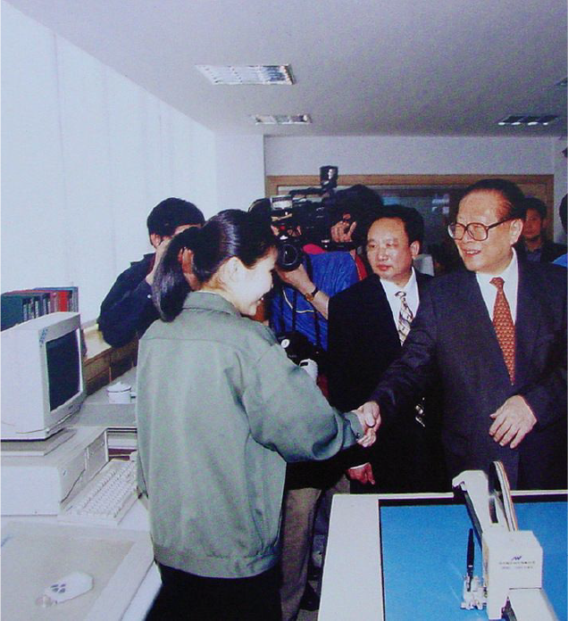
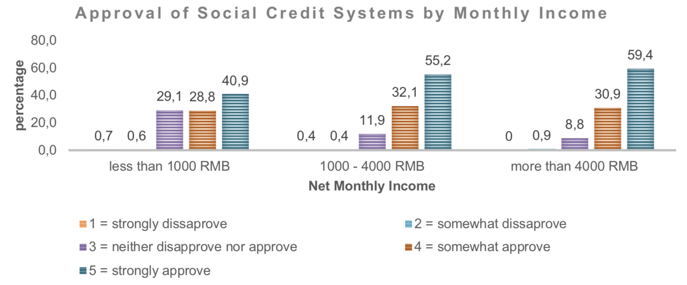

Paris, 30 Novembre 2018

Clément Renaud / http://clementrenaud.com
---
class: center, middle, inverse

# L'Ecriture Exemplaire
## Le numérique comme infrastructure socio-politique en Chine

 

### Clément Renaud - 2018
@clemsos

---
class: center, middle, inverse

# 1. L'Ecriture Exemplaire
---
name:data
class: inverse, center, middle
background-image: url(../MemeWriting/img/a-silicon-wafer-in-sand-maybe.jpg)

# Données
## Evolutions des procédés d'écriture

.small.footnote[ photo: [ExtremeTech](http://www.extremetech.com/computing/178529-this-is-what-the-death-of-moores-law-looks-like-euv-paused-indefinitely-450mm-wafers-halted-and-no-path-beyond-14nm) - Lire : [How to Make a CPU: From Sand to Shelf](http://www.bit-tech.net/hardware/cpus/2010/06/10/how-to-make-a-cpu-from-sand-to-shelf/1)]

---
name:cuneiform
class:inverse, middle, center
background-image: url(../MemeWriting/img/cuneiform.jpg)

# L'écriture artisanale

.small.footnote[ Vente Maison Et Esclave Mâle, Collection Mésopotamie Iran.
 Musée du Louvre - photo: [(c) Claude Valette](https://www.flickr.com/photos/cvalette/9632530128) ]

---
class:inverse
background-image: url(./img/gutenberg-printing-workshop.jpg)

# Infrastructures
## Les réseaux de distribution de l'écriture

---
class:inverse
background-image: url(./img/660px-Grunewald_Isenheim.jpg)

# Exemplarité et écriture
## Façonner les représentations, façonner les humains

---
name:library
class:inverse, middle, center
background-image: url(../MemeWriting/img/bibli.jpg)

# Les industries de l'écriture

.small.footnote[Library in Trinity College, Dublin. Ireland - source:[(c) Ahmet Ertug](http://www.phillips.com/detail/AHMET-ERTUG/NY040114/225)]
---
name:data
class: inverse, center, middle
background-image: url(../MemeWriting/img/google-datacenter.jpg)

# Les industries de l'écriture

.small.footnote[Data Center in Douglas County, Georgia. USA - source: [Google](http://www.google.com/about/datacenters/)]

---
class: center, middle, inverse

# 2. La Chine, civilisation de l'écrit
---

name:confucius
class: middle, inverse

.col-one-half[
# L'écriture régule le territoire

### .small[*Zi Lu dit :*]   "Si le souverain de Wei vous invitait et vous confiait le gouvernement, que feriez vous en premier lieu?"  
 
### .small[*Le Maître dit :]*   "Rectifier les noms ! Pour sûr !"

.footnote.small[*Lunyu, les Entretiens de Confucius*, 13.3, trad. Pierre Ryckmans, Gallimard, 1987.]

]
.col-one-half[

]

---
class: inverse
background-image: url(./img/china-exam.jpg)

# Mandarins et bureaucratie

## L'examen impérial (科举)

---
class: inverse
background-image: url(../EPFL-GoingEast/img/mao-factory.jpg)

# Propagande et exemplarité

## Des centaines de millions d'exemplaires

---
class: center, middle, inverse

# 3. Le numérique comme infrastructure socio-politique

---
class: inverse
background-image: url(../EPFL-GoingEast/img/china-engineer.jpg)

# Le rêve des "ingénieurs rouges"

---
class: center

# Le tournant numérique du monde

.col-one-half[
### Information Highways (1991)

]

.col-one-half[
### Golden Projects (1992)

]

---
class: center
background-image: url(../shenzhen-the-making-of-technology/img/Electronics_factory_in_Shenzhen-min.jpg)

.inverse[
# Fabriquer le "village global"
]

.inverse.footnote[a micro-soldering chain in Shenzhen, Guangdong - .small[photo: Wikipedia]
]

---

class: inverse, cover, middle, center
background-image: url(../EPFL-GoingEast/img/shenzhen.jpg)

.inverse[
# Shenzhen SEZ .small[(1978-2018)]
]
---
class:inverse
background-image: url(./img/mingong-phone.jpeg)

# Le numérique, infrastructure sociale

---
class:inverse
background-image: url(../shenzhen-the-making-of-technology/img/qr.jpg)

# Le numérique, infrastructure urbaine

---
class: center, middle, inverse

# 4. Le "Social Credit Score"
## Réalités numériques et fantasmes totalitaires

---
class:inverse
background-image: url(./img/credit-system-official.jpg)

# Des mesures administratives

## Conçues à l'origine pour les entreprises

---
background-image: url(./img/P2P-lending.jpg)
.inverse[
# Credit score
]

.inverse[
## Réguler la "tontine" numérique et les crédits P2P
]

---
class: inverse
background-image: url(./img/cover_assignes.jpg)

# Listes Noires

## "Veuillez ne pas quitter la ville"

---
class: inverse
background-image: url(./img/food-hygiene-shanghai.jpg)

# Le mythe de la note unique

---
class: center, middle, inverse

# 5. La Bureaucratie 2.0
---
class: center
# Plébiscite de nombreux chinois

### Le "systéme de confiance" : pression sociale et baisse des risques

.footnote.small[ source: *China’s Social Credit Systems and Public Opinion: Explaining High Levels of Approval*, Genia Kotska]

---
class: center, inverse

# Construire un système légal

## A l'heure du numérique

---
class: inverse
background-image: url("./img/Lawrence_Lessig.jpg")

# "Code is Law" .small[(Lessig, 2003)]

---
class: center, middle, inverse

### Conclusion / discussions

# Paperasses ou apps...
## Qui écrit la loi ?   Comment ?
# ... pour quelle justice?

---
class: center, middle

# Merci !
## Des questions ?

 
### @clemsos
### bonjour@clementrenaud.com
