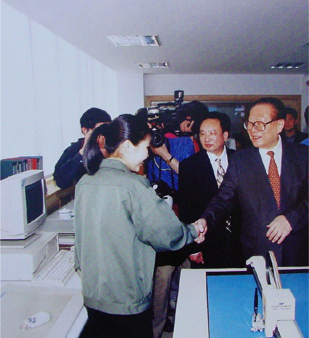

Please use left/right keyboard arrows to navigate prev/next

---
class: center, middle, inverse

# New Frontiers of Representation
## The Planetary Scale

 
### Clément Renaud
### @clemsos

 

2019

---
background-image: url(./img/shan-shui-cheng.jpg)
class: middle, center, inverse
# The World is Changing

<!-- ## The fragility of Earth ecosystems
## Digital solutions and problems
## A new world order -->

---
background-image: url(./img/planetary-boundaries.jpg)

.inverse[
# New Planetary Boundaries
]

.footnote.inverse[
Stockholm Resilience Center
]

---
background-image: url(./img/great-acceleration.png)
.inverse[
# The Great Acceleration
]

.footnote.inverse[
Steffen & al., 2015
]

---
background-image: url(./img/UABB_CARTOGRAPHIES-OF-PLANETARY-URBANISATION_Topalovic.jpg)
.inverse[
# Planetory Urbanisation
]

.footnote.inverse[
Schmid, Brenner & Topalovic, 2018]
]

---
class: inverse
background-image: url(./img/Submarine_Cable.jpg)

.inverse[
# Global Infrastructures
]
.footnote.inverse[
Submarine Cable Map
]

---
background-image: url(./img/Antikythera-Mechanism.jpg)
class: inverse
.inverse[
# Technosphere
]

.footnote.inverse[
(Haff, 2014)
]

---
class: center
background-image: url(../shenzhen-the-making-of-technology/img/Electronics_factory_in_Shenzhen-min.jpg)

.inverse[
# Manufacturing the world
]

.inverse.footnote[
Micro-soldering in Guangdong, Wikipedia
]

---
background-image: url(./img/gravity-shift.jpg)

.inverse[
# Shift in Global Economic Gravity Center
]
.footnote.inverse[
McKinsey / Quah, 2011
]

---
class: center

.inverse[
# Building up the "global village"
]

.col-one-half[
.inverse[Information Highways (1991)]

]

.col-one-half[
.inverse[Golden Projects (1992)]

]

---

class: inverse, cover, middle, center
background-image: url(../EPFL-GoingEast/img/shenzhen.jpg)

.inverse[
# Shenzhen : 1978-2018
]

---
class:inverse
background-image: url(../EcritureExemplaire/img/mingong-phone.jpeg)

# Digital as social infrastructure

---
class:inverse
background-image: url(../EcritureExemplaire/img/credit-system-official.jpg)

.inverse[
# Figuring out the admin rights
]

.inverse.footnote[
Shanghai Gov
]

---
class: inverse
background-image: url("../EcritureExemplaire/img/Lawrence_Lessig.jpg")

# "Code is Law"

.inverse.footnote[
Lessig, 2003
]

---
background-image: url(./img/earth-temperature.png)
.inverse[
# The Digital Regulation of Ecosystems
]

.inverse.footnote[
Berkeley Earth Center
]
---
background-image: url(./img/bitcoin-mining.png)
.inverse[
# The Thermodynamics of Data
]

.footnote.inverse[
Bloomberg Energy Report
]

---
class: inverse
background-image: url(./img/thermal_pi.png)

# Exploring representations

---
background-image: url(./img/micromesomacro.png)

---
background-image: url(./img/atlasofdata.png)

---
background-image: url(./img/seedvault.jpg)

class: middle, center, inverse

# @atlasofdata

 
## Thank you!
