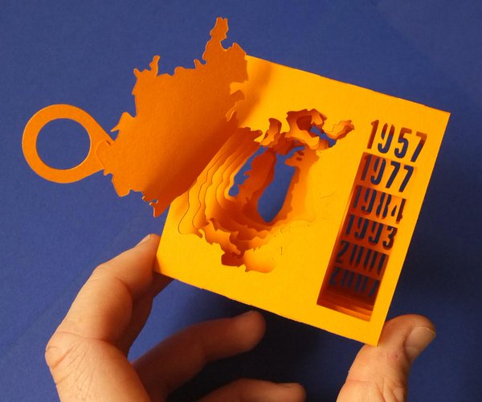

<div markdown="0">

Eléments d'épistémologie du champ de la visualisation  
GeoViz 2018, 17/10/2018


{{page.description}}

---
name:about
class: center, middle, inverse

# Eléments d'épistémologie du champ de la visualisation

### Clément Renaud  
GeoViz 2018, 17 Octobre 2018  
Assois, France


---
class: inverse

# Au programme

## Les joies de l'épistémologie

<br />
<br />

.col-one-half[
### D'où vient la notion de visualisation ?
### Quel est l'action de la visualisation dans le domaine de la représentation?
### Comment est constitué le champ scientifique de la "viz" ?
### etc.
]

.col-one-half[
  
]

---
name:data
class: inverse, center, middle
background-image: url(../MemeWriting/img/a-silicon-wafer-in-sand-maybe.jpg)

# Données
## Evolutions des procédés d'écriture

Nouvelles dimensions de l'écriture : échelle, vitesse, quantité, etc.
 Nouvelles circulations de l'écriture : communication, etc


.small.footnote[ photo: [ExtremeTech](http://www.extremetech.com/computing/178529-this-is-what-the-death-of-moores-law-looks-like-euv-paused-indefinitely-450mm-wafers-halted-and-no-path-beyond-14nm) - Lire : [How to Make a CPU: From Sand to Shelf](http://www.bit-tech.net/hardware/cpus/2010/06/10/how-to-make-a-cpu-from-sand-to-shelf/1)]


---
name:cuneiform
class:inverse, middle, center
background-image: url(../MemeWriting/img/cuneiform.jpg)

# Ecritures

.small.footnote[ Vente Maison Et Esclave Mâle, Collection Mésopotamie Iran.
<br>Musée du Louvre - photo: [(c) Claude Valette](https://www.flickr.com/photos/cvalette/9632530128) ]


---
name:library
class:inverse, middle, center
background-image: url(../MemeWriting/img/bibli.jpg)

# Ecritures

.small.footnote[Library in Trinity College, Dublin. Ireland - source:[(c) Ahmet Ertug](http://www.phillips.com/detail/AHMET-ERTUG/NY040114/225)]
---
name:data
class: inverse, center, middle
background-image: url(../MemeWriting/img/google-datacenter.jpg)

# Ecritures

.small.footnote[Data Center in Douglas County, Georgia. USA - source: [Google](http://www.google.com/about/datacenters/)]

---
name:confucius
class: middle, inverse

.col-one-half[
# La régulation de l'espace de la représentation


Zi Lu dit : *"Si le souverain de Wei vous invitait et vous confiait le gouvernement, que feriez vous en premier lieu"*

Le Maître dit : *"Rectifier les noms ! Pour sûr !"*

.small[*Lunyu, les Entretiens de Confucius*, 13.3, trad. Pierre Ryckmans, Gallimard, 1987.]

En Chine, mais aussi ailleurs : Les mots et les choses (Foucault), la carte et le territoire (Bateson), etc.

]
.col-one-half[


]

---
name: ghibli

# Contruire les lieux de la pensée ?

## Très nombreux travaux
Language (Freud, Sapir & Worph...), images (Didi Huberman), pratiques scientifiques (Christian Jacob...), cartographie numérique *digiplaces* et geotags : Zook, Graham, Crapton...


.left-column[
video
## IA / image de synthèse


**Video** : [Hayao Miyazaki's thoughts on an artificial intelligence](https://www.youtube.com/watch?v=ngZ0K3lWKRc)
]

.right-column[
<iframe width="560" height="315" src="https://www.youtube.com/embed/ngZ0K3lWKRc?rel=0&amp;showinfo=0" frameborder="0" allow="autoplay; encrypted-media" allowfullscreen></iframe>
]


---
name:representation
class: center, middle, inverse
background-image:url(../MemeWriting/img/perspective.png)

# Quel espace commun de la représentation?

## Exemple : La perspective


.small.footnote[Jan Vredeman de Vries – *Traité « Perspective »* (1604) <br>  source: [Denis Favennec](http://math.univ-lyon1.fr/irem/spip.php?article232) ]

<!-- La représentation mathématique du monde
Transformations de rapport sujet / objet, scène / décor, privé / public
L'introduction d'un nouveau "point de vue"
Aide à penser de nouveaux espaces construits : villes, architecture, etc.
ex. Dürer et la Réforme (pertes de job pour les peintres, traités de perspective...)

Transformation de la science aussi : constitution de domaines scientifiques -->

---
name:data
class: inverse, center

# La quantification comme modèle


---
class: center
background-image: url(./img/Playfair_TimeSeries.png)


.footnote[
[William Playfair](https://en.wikipedia.org/wiki/William_Playfair), founder of graphical methods of statistics.
]

---
class: inverse, center
background-image: url(./img/minard-russia.png)

## Charles Joseph Minard

.footnote[
New book ! [The Minard System](https://visionscarto.net/the-minard-system), Rendgen 2018
]

---
background-image: url(./img/snow-cholera-map.jpg)

# John Snow
Cholera cases in the London epidemic of 1854 https://en.wikipedia.org/wiki/John_Snow_(physician)

---
name: construire
class: center, middle

# Tufte, Bertin, etc

.left-column[
  
  *La Sémiologie Graphique*, Bertin (1967)

  
  *Envisioning Information*, Tufte (1990)
]
.right-column[
  
]

---
class: middle

# Penser la complexité

## « Le vrai problème (de réforme de pensée) c’est que nous avons trop bien appris à séparer. Il vaut mieux apprendre à relier. Relier, c’est-à-dire pas seulement établir bout à bout une connexion, mais établir une connexion qui se fasse en boucle. »

Edgard Morin, 1995

---
class: inverse, center
background-image: url(./img/fishing-network.jpeg)

# Réseau : métaphore ou "paradigme"

---
class: inverse, center

# Domaines scientifiques de la visualisation
<br />
.col-one-half[
.col-one-half[
### Net viz
networks!
<br />
<br />


]
.col-one-half[
### Sci viz
bio, neuro, traitement du signal, etc
<br />


]
]


.col-one-half[
.col-one-half[
## Geo viz
maps & more
<br />
<br />
<br />


]
.col-one-half[
## "Data viz"
???
<br />
<br />
<br />
<br />

]
]

---

# La "data viz" comme domaine d'études

.col-one-half[

Sous-domaine de l'informatique, dans la partie où on croise des humains (IHM)

Conférences principales: CHI, Infovis, Eurovis

Stratégies et approches pour la production (et l'évaluation) de visualisations

Design d'interfaces, création d'outils originaux (prototypes mais aussi solutions)

ex. comment montrer de grands écarts? comment filtrer des données?

ex. Notebooks et écriture collaborative (Tabard & al, 2018)


]
.col-one-half[

]

---

# Why visualize?

Find the minimal value for the following equation:

```python
1.3 x^2 + 4 x + 0.6
```

Let's just automatically find the minimal value using `scipy`

```python
import numpy as np
import scipy.optimize as opt

objective = np.poly1d([1.3, 4.0, 0.6])
x_ = opt.fmin(objective, [3])
print("solved: x={}".format(x_))
```

    Optimization terminated successfully.
             Current function value: -2.476923
             Iterations: 20
             Function evaluations: 40
    solved: x=[-1.53845215]


---

## Now, using visualization

```python
x = np.linspace(-4, 1, 101.)
plt.plot(x, objective(x))
plt.plot(x_, objective(x_), 'ro')
plt.show()
```


---
background-image:url(./img/infovis-raw.png)

## Ex. Treisman, Preattentive Processing (1985)


---
background-image:url(./img/infovis-raw-2.png)

## Ex. Treisman, Preattentive Processing (1985)

---
class: middle

# Une grammaire visuelle... combinatoire

**Graphical Marks** .small[(Line, Circle, Rectangle...)]  
x **Properties**  .small[(Position, Size, Color...)]  
x **Data transformation** .small[(Selection, Binning, Aggregation...)]
<hr />
=  **Huge number of permutations** (even for small and simple datasets)


.small[ref Gelstat]

---
background-image:url(./img/ewma_correction.png)

---
class: middle, inverse

## "Since most users do not want to become experts in human perception, our strategy is to incorporate guidance directly into the visualization software to aid in the the visual design process"

How to NOT lie with visualization (Rogowitz & Treinish, 1996)

---


The Eyes Have It: A Task by Data Type Taxonomy for Information Visualizations (Shneiderman, 1996)

---

# A Task-based Approach

## "We discuss how smooth animations from one view to another can be defined."

Smooth and efficient zooming and panning (Wijk & Nuij, 2003)

## "An effective use of color will group related items and command attention in proportion to importance"
Choosing Colors for Data Visualization (Stone, 2006)

## "We begin by discussing imagery acquisition, the task that drove the design process for Hotmap. "
Hotmap: Looking at Geographic Attention (Fisher, 2007)

---
# Une science graphique est-elle possible?

.col-one-half[
## Les limites de l'approche par tâches  
Comment définir les "problèmes"?


## Création _ad hoc_ ou réutilisation de modèles?  
ex. chi2 et corrélation

## Interprétations
Enjeux "culturels" et activités symboliques - ex. les couleurs
]

.col-one-half[

.small[Infographic : [What Colors Mean in Different Cultures](https://visual.ly/community/infographic/other/what-colors-mean-different-cultures)]


]


---
# Dépasser la représentation visuelle?

.col-one-half[
## Sonification
Music of Brain and Music on Brain: A Novel EEG Sonification approach (Nag, 2017)


]

.col-one-half[
## Dataphys
[3D Paper Model of Shrinking Aral Sea](http://dataphys.org/list/3d-paper-model-of-shrinking-aral-sea/) (Vojtek,2015)



http://dataphys.org
]

---
class: center, inverse
background-image:url(./img/micromesomacro.png)

## Coupure Pub


https://micromesomacro.com
