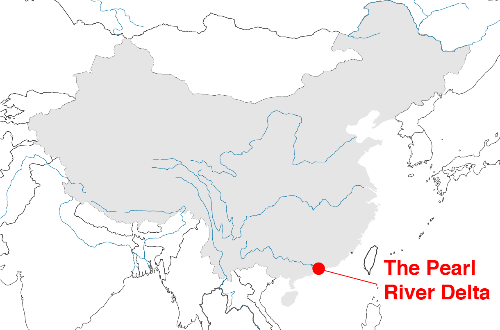
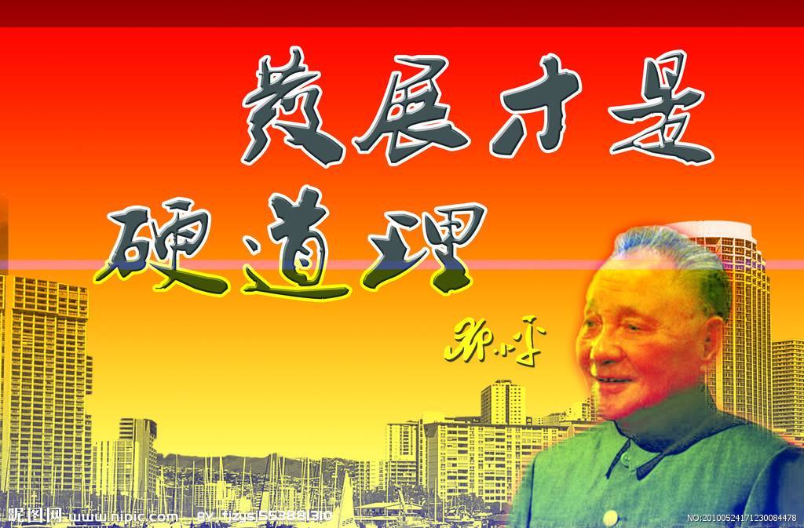
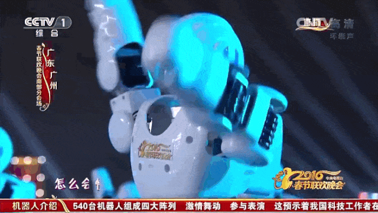

Please use left/right keyboard arrows to navigate prev/next
---
class: center, middle, inverse

# The Making of Technology in Shenzhen
##  Local and Global Implications

 
### Clément Renaud  
<!-- @clemsos -->

 
London, May 2018  

---

class: center

.inverse[
# The South of Southern China
]

---
class: inverse
background-image: url(./img/PRD_economist.png)

.inverse[
# A Megacity in the making
]
---
class: center
background-image: url(./img/Pearl_River_Delta_Area.png)
.inverse[
# Historical Legacy in the Pearl River Delta
]

.inverse.footnote[80-100 millions people, four different legal and fiscal systems, two stock markets,	40% of global port traffic, etc...]

---
class:center
background-image: url(./img/PRD_history.jpg)

.inverse[
# Centuries of Global Trade in Guangdong
]

.inverse.footnote[source: [Wright, Arnold (1908)](https://archive.org/details/twentiethcentury00wriguoft)]

---
.inverse[
# How things went (not?) South
]

.left-column[

Sep 9, 1976  
**Death of Mao Zedong**
End of the Cultural Revolution  

Dec 1978  
**Beginning of economic reform**  
改革開放

May 1980  
**Shenzhen Special Economic Zone**  
深圳经济特区  

Jan-Feb 1992  
**The Southern tour**  
南巡  

]

.right-column[

*“Development is the only reasonable way”*
]

---
class: inverse
background-image: url(../EPFL-GoingEast/img/china-engineer.jpg)

.inverse[
# The Dream of the Red Engineers
]

---
class: inverse, cover, middle, center

# "We should dare to experiment and break a new path. That is the important lesson to be learned from Shenzhen."

[Deng Xiaoping](https://dengxiaopingworks.wordpress.com/2013/03/18/excerpts-from-talks-given-in-wuchang-shenzhen-zhuhai-and-shanghai/) - Jan 20, 1992 in Shenzhen

---

class: inverse, cover, middle, center
background-image: url(../EPFL-GoingEast/img/shenzhen.jpg)

.inverse[
# Shenzhen : 1982-2017
]
---
class: inverse
background-image: url(./img/xia_hai.jpeg)

.inverse[
# 90s: Jumping into the sea .small[“下海”]
]

.footnote[
image: Taiwan Mobile (大哥大)
]

---
class: center

.inverse[
# Building up a digital infrastructures
]

.col-one-half[
.inverse[Information Highways (1991)]

]

.col-one-half[
.inverse[Golden Projects (1992)]

]

---
class: center
background-image: url(./img/Electronics_factory_in_Shenzhen-min.jpg)

.inverse[
# Manufacturing the "global village"
]

.inverse.footnote[a micro-soldering chain in Guangdong   
.small[photo: Wikipedia]
]

---
class: middle, center
background-image: url(../ShanzhaiArcheology/img/HQBstuff.jpg)

.inverse[
# Urban clusters for electronics   
]

.inverse.footnote[Huaqiang Bei district in Shenzhen]

---
class: middle, center
background-image: url(../ShanzhaiArcheology/img/HQBlife.jpg)

.inverse[
# The family-based factory
]

---
class: inverse, center
background-image: url(img/remote_exploded.jpg)
.inverse[
# Learning from scratch
]

.footnote[image: [Bug Workshop](http://bugworkshop.blogspot.co.uk/2014/11/sonyrm-677c.html)]
---
background-image: url(./img/iPhones.jpg)
class: center, middle

.inverse[
# shan zhai 山寨
]

---

background-image: url(../ShanzhaiArcheology/img/ShanzhaiBox.jpg)
.inverse[
# Quality fakes: AAA货
]

---
background-image: url(../ShanzhaiArcheology/img/PowerBankPhone.png)
class:center

.inverse[
# The PowerBank Phone
]
.left-column[

.inverse[
Accra, Ghana  
June 2015
]

.small[[Quartz Africa](https://qz.com/411330/the-mystery-of-the-power-bank-phone-taking-over-ghana/)  ]
]

---
class: inverse
background-image: url(../ShanzhaiArcheology/img/shapes-shanzhai.jpeg)

# Shanzhai Archeology

---
background-image:
class: center, middle, inverse

# Towards a Shenzhen model?
### How the city is going global

---
class: middle, center
background-image: url(../ShanzhaiArcheology/img/ShenzhenMap.png)

.inverse[
# Going to Shenzhen
]
---
class: center
background-image: url(../ShanzhaiArcheology/img/cat-skype.png)

.inverse[
# Striving on Kickstarter 101
]
---
class: inverse

.left-column[
  # Global politics of making
]
.right-column[
  
]

---
background-image: url(../EPFL-GoingEast/img/made-in-china-2025.jpg)
class: inverse

.inverse[
# Made in China 2025
]
---
class: inverse
background-image: url(../EPFL-GoingEast/img/chuangke.jpg)

.inverse[
# Build a "maker's heaven"
]

.footnote[The maker (创客), new hero of the nth industrial revolution]

---
class: center

.inverse[
#  Shenzhen: fabricating future industries
]

.inverse[
### Producing giants (Tencent, Huawei, BYD, DJI, BGI, Ping An, etc.)
]

.small[
2017 Chinese New Year TV show  
featuring a ballet of robots by Shenzhen company *UBTech*  
dancing with the famous singer Sun Nan
]

---
class: center
background-image:url(./img/onebelt-oneroad.jpg)

.inverse[
# The export of the Chinese city...
]

.footnote.inverse[
...towards Central Asia, Middle East, Africa and Europe.
]

---
class: center, middle

# Thank you all for your attention
## Questions ?

 
### @clemsos
