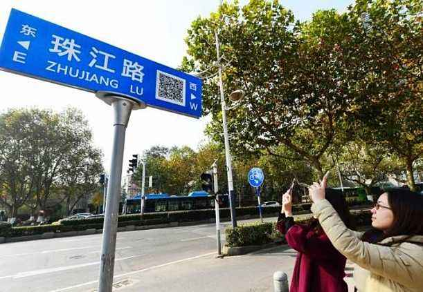
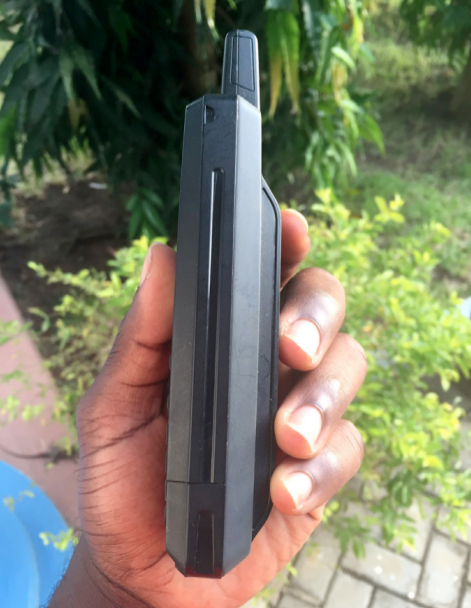

Please use left/right keyboard arrows to navigate prev/next
---
class: center, middle, inverse

# The Making of Technology in Shenzhen
##  Local and Global Implications

 
### Clément Renaud

Swiss Institute of Technology  
 
2018  

---
class:inverse

.col-one-half[
# Happy Birthday Shenzhen!

June 30th, 2018  
<small>40 years old</small>
]

.col-one-half[

]

<video width="800" controls>
<source src="https://scontent-atl3-1.xx.fbcdn.net/v/t66.18014-6/36441672_1980668251984476_4394509737529828412_n.mp4?_nc_cat=0&efg=eyJ2ZW5jb2RlX3RhZyI6Im9lcF9oZCJ9&oh=f221358d7111a26805108caca12a4964&oe=5BE79C62" type="video/mp4"  >
</video>
---

class: inverse, cover, middle, center
background-image: url(../EPFL-GoingEast/img/shenzhen.jpg)

.inverse[
# Shenzhen : 1978-2018
]

---
class: middle, center
background-image: url(../ShanzhaiArcheology/img/HQBstuff.jpg)

.inverse[
# World center of consumer electronics   
]

.inverse.footnote[Huaqiang Bei district in Shenzhen]

---

class: center
background-image: url(./img/Pearl_River_Delta_Area.png)
.inverse[
# The Pearl River Delta
]

.align-right.inverse.footnote[80-100 millions people, four different legal and fiscal systems,  
two stock markets,	40% of global port traffic, etc...
]

---
class:center
background-image: url(./img/PRD_history.jpg)

.inverse[
# Legacy of a Global History
]

.footnote.small[
A trade port in Guangdong at the end of the 19th Century -  source: [Wright, Arnold (1908)](https://archive.org/details/twentiethcentury00wriguoft)
]

---
class: inverse
background-image: url(../EPFL-GoingEast/img/china-engineer.jpg)

.inverse[
# The Dream of the Red Engineers
]

---
class:inverse

# "We should dare to experiment and break a new path. That is the important lesson to be learned from Shenzhen."

[Deng Xiaoping](https://dengxiaopingworks.wordpress.com/2013/03/18/excerpts-from-talks-given-in-wuchang-shenzhen-zhuhai-and-shanghai/) - Jan 20, 1992 in Shenzhen

.col-one-half[

]

.col-one-half.small[

Sep 9, 1976  
**Death of Mao Zedong**
End of the Cultural Revolution  

Dec 1978  
**Beginning of economic reform**  
改革開放

May 1980  
**Shenzhen Special Economic Zone**  
深圳经济特区  

Jan-Feb 1992  
**The Southern tour**  
南巡  

]

---
class: inverse, middle, center
background-image: url(./img/cny-robodance.gif)

.inverse[
# Nurturing tech giants
]

.inverse[
### Foxconn but also Tencent, Huawei, BYD, DJI, BGI, Ping An...
]

.footnote.small[
2017 Chinese New Year TV show featuring a ballet of robots by Shenzhen company *UBTech*  
dancing with the famous singer Sun Nan - source: CCTV
]
---
class: inverse
background-image: url(./img/xia_hai.jpeg)

.inverse[
# 90s: Jumping into the sea .small[“下海”]
]

.footnote[
image: Taiwan Mobile (大哥大)
]

---
class: center

.inverse[
# Building up digital infrastructures
]

.col-one-half[
.inverse[Information Highways (1991)]

]

.col-one-half[
.inverse[Golden Projects (1992)]

]

---
class: center
background-image: url(./img/Electronics_factory_in_Shenzhen-min.jpg)

.inverse[
# Manufacturing the "global village"
]

.inverse.footnote[a micro-soldering chain in Guangdong   
.small[photo: Wikipedia]
]

---
class: middle, center
background-image: url(../ShanzhaiArcheology/img/HQBlife.jpg)

.inverse[
# The family-based factory
]

---
class: inverse, center
background-image: url(img/remote_exploded.jpg)
.inverse[
# Learning from scratch
]

.footnote[image: [Bug Workshop](http://bugworkshop.blogspot.co.uk/2014/11/sonyrm-677c.html)]

---
background-image: url(./img/iPhones.jpg)

.inverse.center[
# ☆ AAA货 ☆
]

---
class: center, middle, inverse
background-image: url(../ShanzhaiArcheology/img/shapes-shanzhai.jpeg)

.inverse[
# shan zhai 山寨
]

.footnote.small[
[SHANZHAI ARCHEOLOGY](http://disnovation.org/shanzhai.html) by DISNOVATION.ORG, Qu Hongyuan & Clément Renaud
]

---
class: center

.inverse[
# Trying all sort of things
]

.inverse[
## To face very large problems
]

---
class: inverse
background-image: url(../EPFL-GoingEast/img/chuangke.jpg)

.inverse[
# Build a "maker's heaven"
]

.footnote[The maker (创客), new hero of the **Made in China 2025** 10-year plan]

---
class: middle, center
background-image: url(../ShanzhaiArcheology/img/ShenzhenMap.png)

.inverse[
# Bring people to Shenzhen
]

---
class: center
background-image: url(../ShanzhaiArcheology/img/cat-skype.png)

.inverse[
# Faster, faster... but why?
]

.footnote.small[
source: HAX Kickstarter
]

---
background-image: url(../ShanzhaiArcheology/img/PowerBankPhone.png)
class:center

.inverse[
# Export tech and uses across the world
]
.left-column[

.inverse[
Accra, Ghana (2015)

source: [Quartz Africa](https://qz.com/411330/the-mystery-of-the-power-bank-phone-taking-over-ghana/)  ]

]

---
background-image: url(./img/china-city-johannesburg.jpg)
class:center, inverse

.inverse[
# Design emerging spaces
]

.footnote.inverse[
China city in Johannesburg - source: Quartz
]
---
class: center, middle

# Thank you all for your attention
## Questions ?

 
### @clemsos
