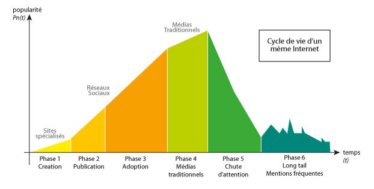
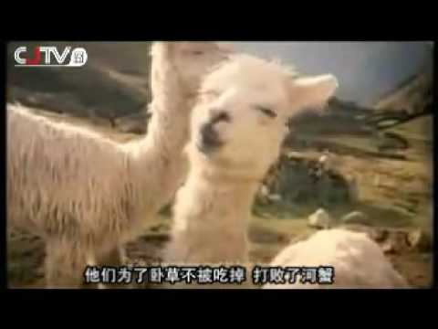
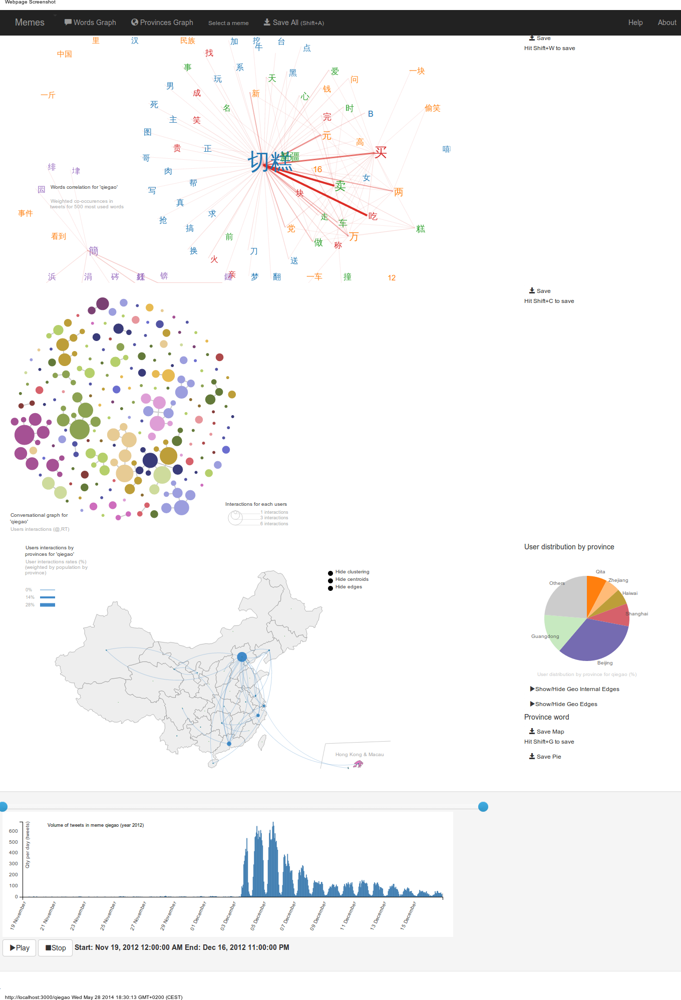
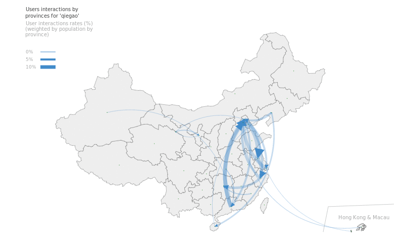
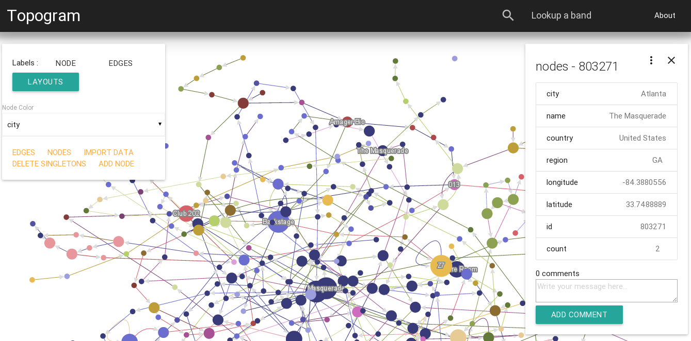
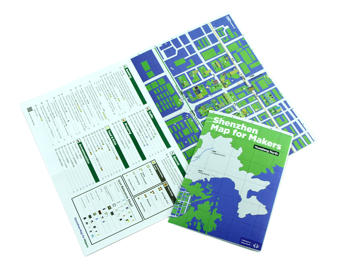

---

Lyon, 7 Avril 2016.

Clément Renaud / http://clementrenaud.com
---
class: center, middle

# Représenter l'évolution spatio-temporelle de réseaux
### Clément Renaud  

Lyon, Oct 2017

---
class: inverse
background-image: url(img/supercargo-img1.png)

.footnote[
# Why study change ?

[Peter Moossgard](http://cargoclub.tumblr.com/), 2016
]
---
# Is ontology over-rated?

### Questions of definitions : Ontological reflections may be over-rated

Transversal reflections for multiple scientific disciplines : what is the effect of time?

.col-one-half[
### Learning from China
- most of the time, things are often not what they appear to be
- everything change all the time

Illusion of permanence ? ignorance for decay? 'the same, but better'?
]

.col-one-half[

]

---

# Observing Change

###  how to visualize changes ? esp. changes in complex structures ? how to record changes ?

---

class: center, middle

## Some Examples
(2010-2017)

---
class: middle
## Example 1: Design of a Internet memes data visualisation toolkit

.right-column[

**The case of the Chinese social network Sina Weibo**
We develop a data mining and visualisation toolkit to study how the information is shared on online social network services. This software allows to observe relationships between conversational, semantical, temporal and geographical dimensions of online communication acts.Internet memes are short messages that spread quickly through the Web.
]

.left-column[

]

---
## Custom visualization software
[http://clementrenaud.com/phD](http://clementrenaud.com/phD) - [(code)](http://github.com/clemsos/mitras)

---
## Spatio-temporal conversations

---

## Example 2: Historical cartography of university in Europe

[http://clementrenaud.com/carto-univ](http://clementrenaud.com/carto-univ) - [(code)](http://github.com/clemsos/carto-univ)

This was a small attempt to visualize how universities spread around Europe. We worked on it with Eric Guichard at [AIL](http://barthes.enssib.fr/AIL), based on data compiled by Camille Ducrot. There is several major flaws in this map : the first one being borders... Obviously, looking at Europe with border data from the 16th century does not make any sense.

---

## Example 3: Topogram

[http://topogram.io](https://topogram.io) - [(code)](http://github.com/topogram/topogram) - ongoing project...

Topogram is an open-source software to visualize changes in networks over time and space. It relies on web technologies to provide a web experience.

---

## Example 4: Makerspaces in China

Studying interactions between a global movement and policy-making locally
[http://mapmakers.space](https://mapmakers.space)

---
class: center, middle

## Discussions / Conclusion

---

.left-column[
# Networks as events

### Networks are not "facts"
A sum of trajectories

### Multiple layers to explore
Words, social networks, physical movements, etc.

### Lots of work !
Theoretical, empirical, tools, etc.

(see js lib [graph-events](https://github.com/clemsos/graph-events))

]

.right-column[

]

---
class: middle,center

## Thank you !

clement.renaud@gmail.com

@clemsos
