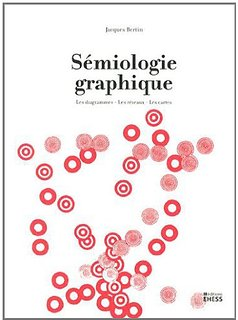
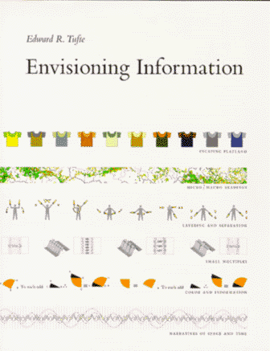
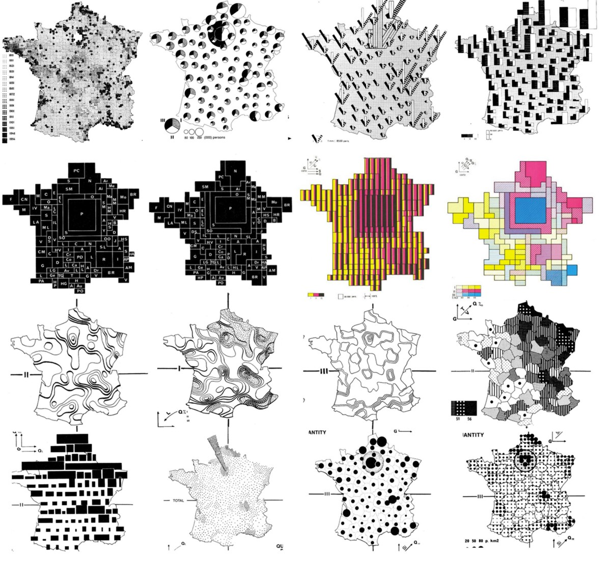
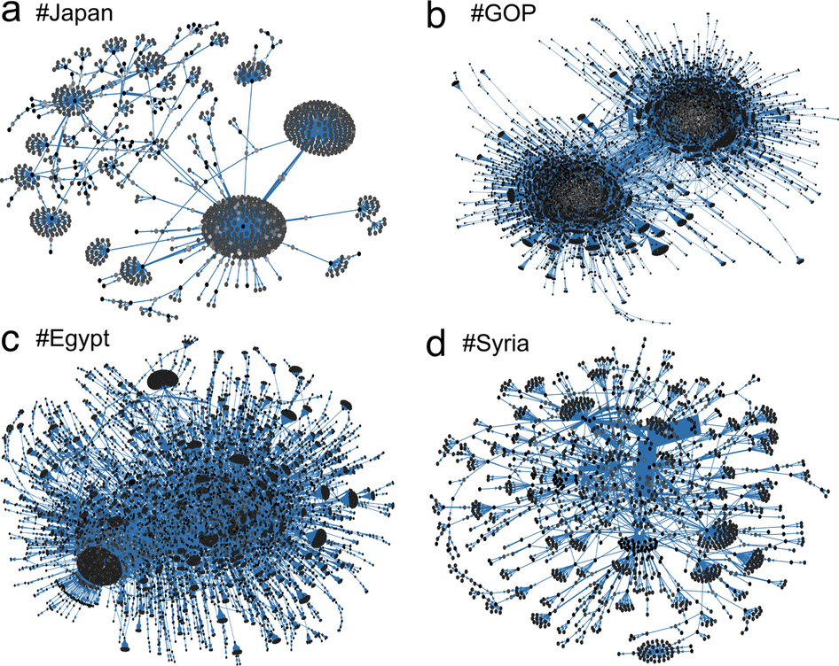
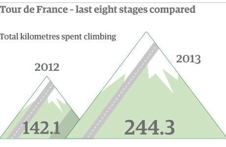
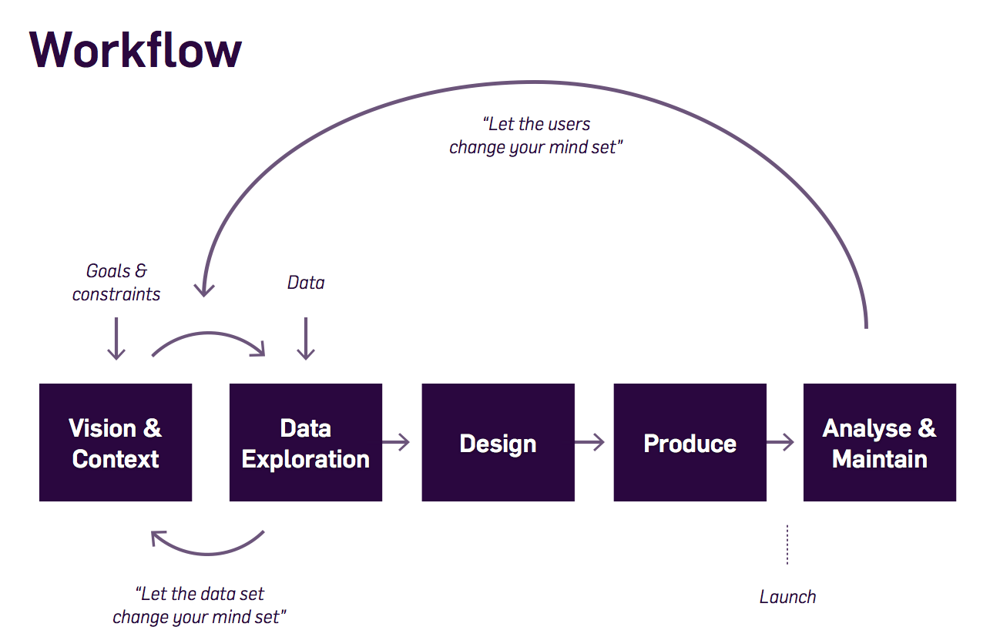
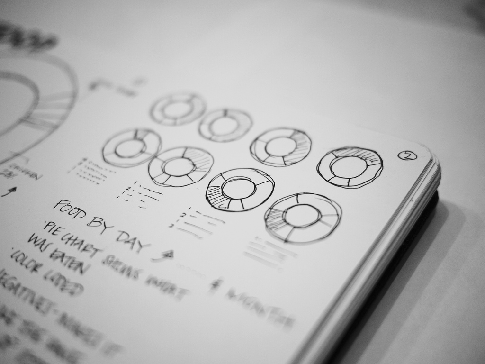
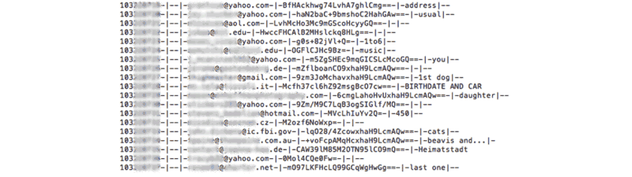
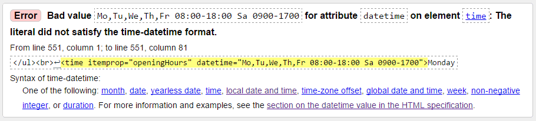
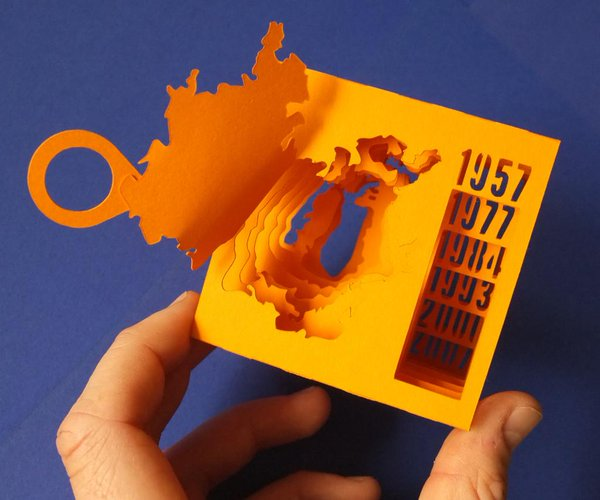

d3codages, 14/12/2016

---
name:about
class: center, middle, inverse

# Dataviz : comment développe-t-on une application de visualisation de données?

### Clément Renaud  
Les Subsistances, 12 Dec 2016  

---
class: middle, inverse

# Objectifs aujourd'hui

### 1. Contexte : les écritures numériques
### 2. Qu'est-ce que la visualisation de données ?
### 3. La structure d'un projet de visualisation
### 4. Exemple : cartographie historique des universités
### 5. Créer / définir un (votre) projet

---
class: middle, inverse

# Ce qu'on ne va (peut) pas faire

### Apprendre à "coder"
### Réaliser entièrement un projet de dataviz
### Fournir une liste exhaustive des outils utilisés

---
class: middle, inverse

# 1. Contexte : les écritures numériques

### La visualisation comme pratique culturelle

---
name:cuneiform
class:inverse, middle, center
background-image: url(../MemeWriting/img/cuneiform.jpg)

# Ecritures

.small.footnote[ Vente Maison Et Esclave Mâle, Collection Mésopotamie Iran.
 Musée du Louvre - photo: [(c) Claude Valette](https://www.flickr.com/photos/cvalette/9632530128) ]

---
name:library
class:inverse, middle, center
background-image: url(../MemeWriting/img/bibli.jpg)

# Ecritures

.small.footnote[Library in Trinity College, Dublin. Ireland - source:[(c) Ahmet Ertug](http://www.phillips.com/detail/AHMET-ERTUG/NY040114/225)]
---
name:data
class: inverse, center, middle
background-image: url(../MemeWriting/img/google-datacenter.jpg)

# Ecritures

.small.footnote[Data Center in Douglas County, Georgia. USA - source: [Google](http://www.google.com/about/datacenters/)]

---
class:  center, inverse

# Economie de l'attention

.small[[Voir la vidéo](http://www.bilibili.com/video/av2023391/)]

---
class: middle, inverse

# 2. Visualiser

### Construire des représentations de phénomènes souvent complexes

---
name:representation
class: center
background-image:url(../MemeWriting/img/perspective.png)

# Quel espace commun ?

.small.footnote[Jan Vredeman de Vries – *Traité « Perspective »* (1604)    source: [Denis Favennec](http://math.univ-lyon1.fr/irem/spip.php?article232) ]

---
name:construire
class: center, middle

# Contruire des représentations adaptées

.left-column[
  
  *La Sémiologie Graphique*, Bertin (1967)

  
  *Envisioning Information*, Tufte (1990)
]
.right-column[
  
]

---
name:nicolasMaigret
class: center, middle, inverse

# Donner à voir : la matière

<iframe src="https://player.vimeo.com/video/36626555?byline=0&portrait=0" width="700" height="393" frameborder="0" webkitallowfullscreen mozallowfullscreen allowfullscreen></iframe>

System Introspection par [Nicolas Maigret](http://peripheriques.free.fr/blog/index.php?/works/2010-system-introspection/)

---
name:networkeffect
class: inverse, center, middle

# Donner à voir : le temps

*"From your IP address, we see you live in France, where the average life expectancy is 81.5 years — so after 8.15 minutes (8:09), your access will be blocked for a day, so you can get back to your life."*

<iframe width="640" height="360" src="https://www.youtube.com/embed/2LsLmcWP6-M?rel=0&amp;showinfo=0" frameborder="0" allowfullscreen></iframe>

.small[[Network Effect](../MemeWriting/img/http://networkeffect.io/) by Jonathan Harris]

---
class: center, middle
.footnote.small[source : [Competition among memes in a world with limited attention](http://www.nature.com/articles/srep00335), *Nature*, 2012]

---
name:napoleon
class: inverse, center, middle

# Donner à voir : la campagne de Russie

.small[*La Carte figurative des pertes successives en hommes de l’Armée française dans la campagne de Russie en 1812-1813*   Joseph Minard, 1869. - source: [Wikipedia](https://fr.wikipedia.org/wiki/Charles_Joseph_Minard#/media/File:Minard.png)]

---
name:napoleon
class: inverse, center, middle

# Donner à voir : l'évolution du dénivelé du tour de France

.small[[*The Guardian, Sport*](https://www.theguardian.com/sport/2013/jul/12/tour-de-france-2013-pain) ]

---
class: middle

# 3. Comment faire ?

### Techniques et méthodes pour concevoir un projet de visualisation
---
class: middle

## Un projet de visualisation

.small[d'après Stefaner, in [GhostWeather](http://blogger.ghostweather.com/2013/11/data-vis-consulting-advice-for-newbies.html) ]

---
class: middle

## Poser une question - esquisser une hypothèse?

.footnote[.small[d'après *Food Consumed in 2010* de [L. Manning](https://www.flickr.com/photos/laurenmanning/5674438518/in/album-72157626586750924/)]]

---
# Explorer les données

### Construction des "obtenues" <small>(Latour, 2013)</small>

Avec par exemple : [Tableau](http://www.tableau.com/), [R](https://www.r-project.org/), [Trifacta Wrangler](https://www.trifacta.com/products/wrangler/), Excel, etc.
---
class: middle

# Choisir une représentation

.left-column[
 
## Pas de réponses, que des choix...

**Le choix d'un modèle de représentation dépend**

* des hypothèses / questions
* du type de données
* des contraintes / capacités techniques
* du contexte graphique (écran, papier, entouré de pub, etc.)
* des utilisateurs
* etc.

Néanmoins, certains modèles existent - voir galerie sur  [D3js](https://d3js.org/)
]

.right-column[
  
]

---
class: middle, inverse

# Construire votre propre vis(ualisat)ion

.footnote[ .small[ [3D Paper Model of Shrinking Aral Sea](http://dataphys.org/list/3d-paper-model-of-shrinking-aral-sea/) by Peter Vojtek (2015) sur [dataphys.org](http://dataphys.org) ] ]

---
class: middle, inverse
# 4. Lisons un peu de code

### Exemple : Carto historique des universités

[https://clementrenaud.com/carto-univ](https://github.com/clemsos/carto-univ)  

[https://github.com/clemsos/carto-univ](https://github.com/clemsos/carto-univ)

---
class: middle, inverse
# 5. Votre projet de visualisation de données

### Vos idées, vos données : on regarde ensemble
