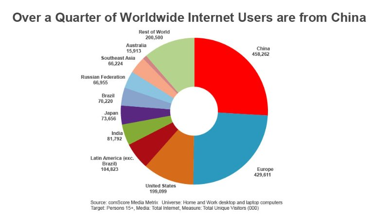
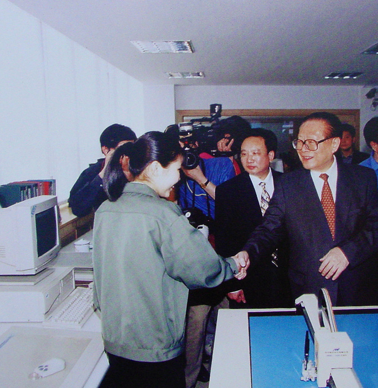
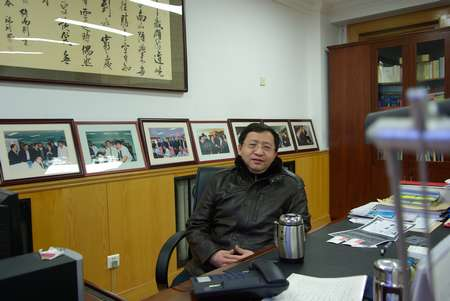
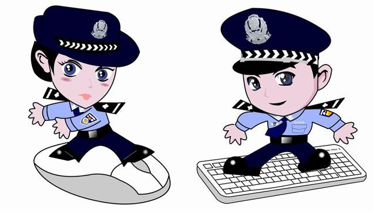
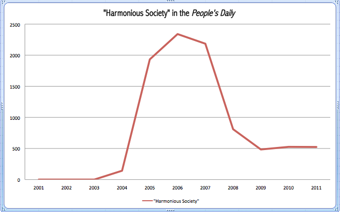
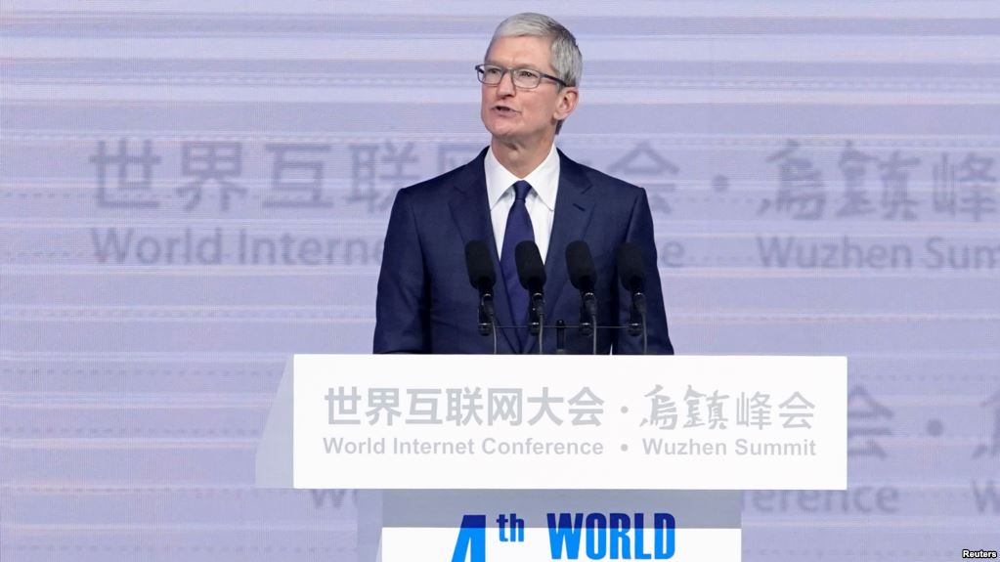
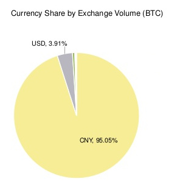
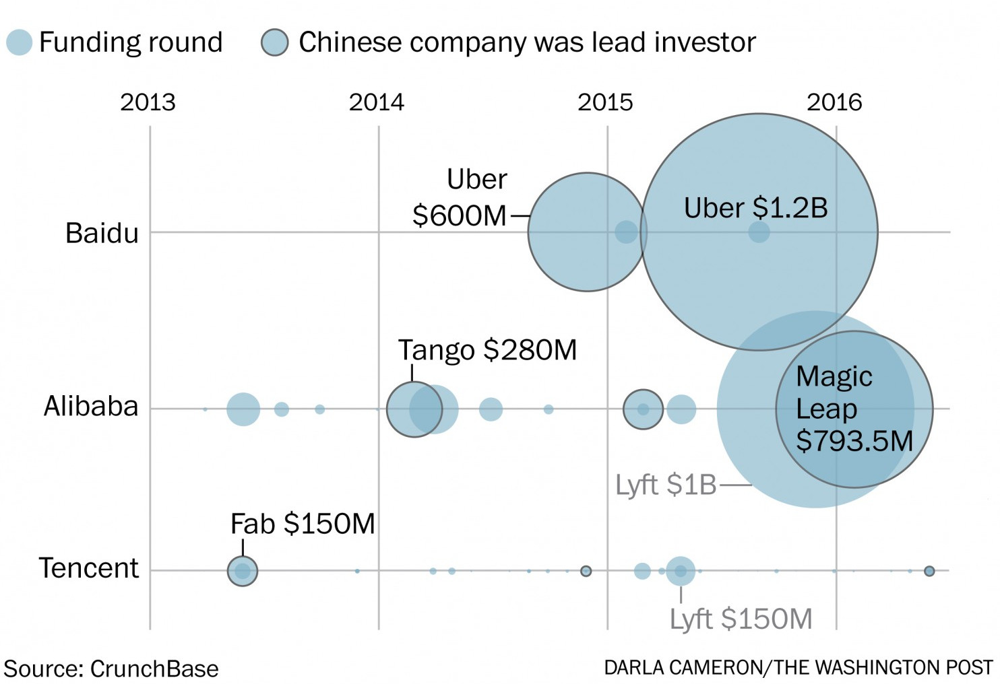
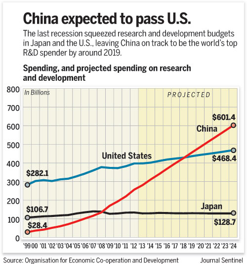

EPFL, 12/12/2016

---
name:title
class: center, middle, inverse

# Tectonique des réseaux
### Le numérique en Chine

### Clément Renaud  
EPFL, Lausanne - 2017
---
# L'Internet et le numérique en Chine

---
class: inverse
background-image: url(../EPFL-GoingEast/img/china-engineer.jpg)

# Le Rêve des ingénieurs rouges

---
class: inverse
background-image: url(img/ordi-maozedong.jpg)

# Fabriquer des machines

.footnote.small[
(Science, 1973)

"Console of the 109C at the Peking Institute of Computing Technology.The Chinese inscription is a quotation from Chairman Mao"
]

---
class: inverse
background-image: url(../ShanzhaiArcheology/img/HQBstuff.jpg)

# Shenzhen, monde de l'électronique
.footnote[Huaqiang Bei district]

---
# Early Days : the Golden Projects

.col-one-half[
### Information Superhighways (US)

.small[Dec. 9, 1991 : National Information Infrastructure (NII)  ]
]

.col-one-half[
### Golden Projects (China)

.small[Golden Card (1992), Golden Shield (1993), etc.]
]

---
class: inverse
background-image: url(img/great-wall-lots-of-people.jpg)

# The "Great Firewall" of China

.left-column[

> ## "I have six VPNs on my home computer, but I only try them to test which side wins: the GFW or the VPN."

Fang Binxing dans le [Global Times du 18 Fev 2011](http://www.china.org.cn/china/2011-02/18/content_21951602.htm)

]

---
class: inverse
background-image: url(img/IllegalFlowerTribute1.jpg)

# Les géants sont priés de se diriger vers la sortie

---

# L'invention de "l'Internet Chinois"

.left-column[

Jing jing & Chacha (source: CDT 2014)

* Données : matériaux de mémoires
* La régulation de l'écriture comme méthode d'administration

Paper : *Through the Looking Glass: Twenty Years of Chinese Internet Research* Herold & De Seta, 2016
]
.right-column[

L'Internet et le devenir “civilisé” du pays
]

---
class: inverse
background-image: url(img/mingong-shouji.jpg)

# Urbanisation par le réseau

.footnote[]
---
class: inverse
background-image: url(img/kuaidi.jpg)

# La grande valse des colis
Le monde urbanisé et la "sharing economy"

---
# Tectoniques des réseaux

.left-column[

World Internet Conference in Wuzhen, Dec 2017

Currency Share by Exchange Volume (source: CoinDesk / Bitcoinify)
]

.right-column[
> ### “China should speed up its effort to improve our digital infrastructure” - .small[Xi Jinping, 9 Dec 2010]

]

---
class: middle, center
# R&D, éducation et innovation

---
class: middle

#### Conclusion
# La Chine, prochaine frontière des réseaux ?

## Nouveau modèle politique des réseaux
## Développements techno-industriels (AI, cars, etc.)
## Leadership in fab
## Cities, cities, cities !

---
class: middle, center

# Merci :)
clement.renaud@epfl.ch

@clemsos
---

