

v0 : Lyon, 17 Octobre 2017
v1 : geoViz 2018, Aussois, 16 Octobre 2018

Clément Renaud / http://clementrenaud.com
---
class: center, middle, inverse

# Représenter l'évolution spatio-temporelle de réseaux
### Clément Renaud  
[http://clementrenaud.com](bonjour@clementrenaud.com)

Oct 2017

---
class: inverse
background-image: url(img/supercargo-img1.png)

.footnote[
# Comprendre les changements

[Peter Moossgard](http://cargoclub.tumblr.com/), 2016
]

---

.col-one-half[
# Représenter le temps

changement = projection dans le temps
Penser "en 4D"?

]

.col-one-half[
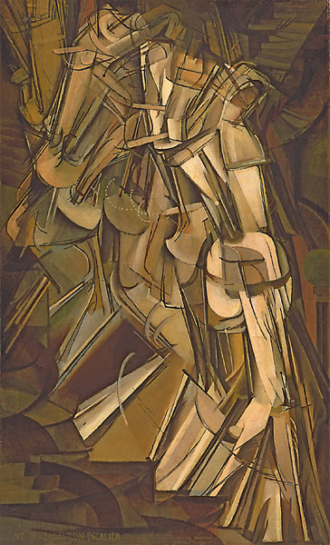
]

---
class: middle
# Le problème : comment change un réseau .small[(spatialisé)]?
## Quelle différence dans un réseau à t0 et t1?

iSphere : Du et al, CHI 2017 [https://www.youtube.com/watch?v=ZDmHhmEwBro](https://www.youtube.com/watch?v=ZDmHhmEwBro)

---

# Le temps : un axe linéaire évident?

.col-one-half[
### Echelles des temps
### temps multiples
### Navigation temporelle
etc.

ex. John Sparks, _The Histomap_, New York, 1931
]

.col-one-half[
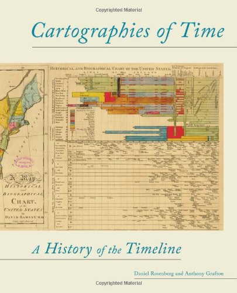
]

---

# Les transitions temporelles

Apport du numérique dans ce domaine :  [transitions d3.js](http://bl.ocks.org/Kcnarf/9e4813ba03ef34beac6e)  

#### Example 2: [Historical cartography of university in Europe](http://clementrenaud.com/carto-univ) - [(code)](http://github.com/clemsos/carto-univ)

.footnote[
UNFINISHED work Eric Guichard at [AIL](http://barthes.enssib.fr/AIL), based on data compiled by Camille Ducrot.

.small[See also counter-ex. [Changement climatique IPCC](https://theatlasofdata.github.io/ecoflow/bubble/bubble_mix.html)]
]

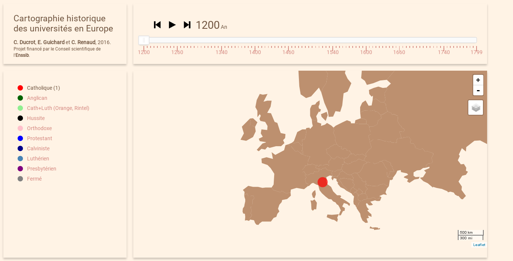

---
# Visualiser le changement dans un réseau

d'après Beck et al 2017
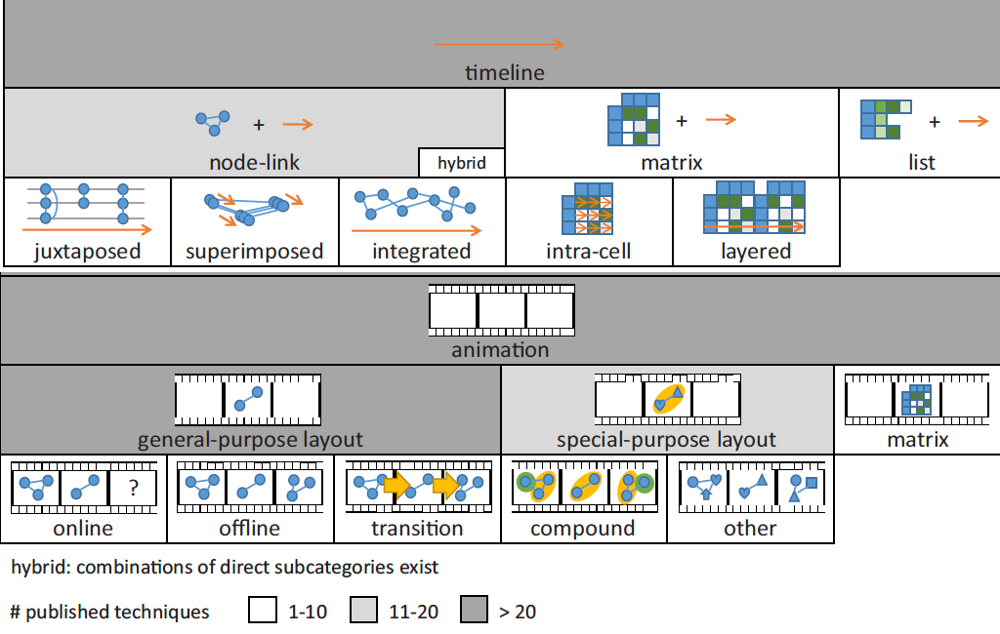

---
# Le diagramme "affluvial"

ex. The ["Sankey" diagram](https://beta.observablehq.com/@mbostock/d3-sankey-diagram) example by @mbostock

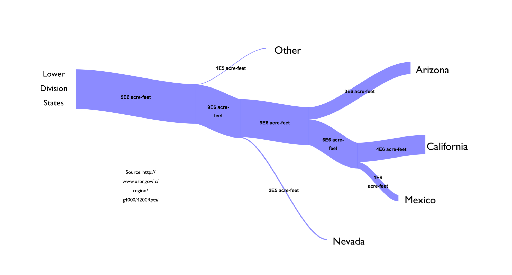

---

# Minard is back

---

# Le Politoscope

ex. [La reconfiguration entre deux tours ](https://politoscope.org/2017/05/entre-deux-tours/) : politique sur Twitter

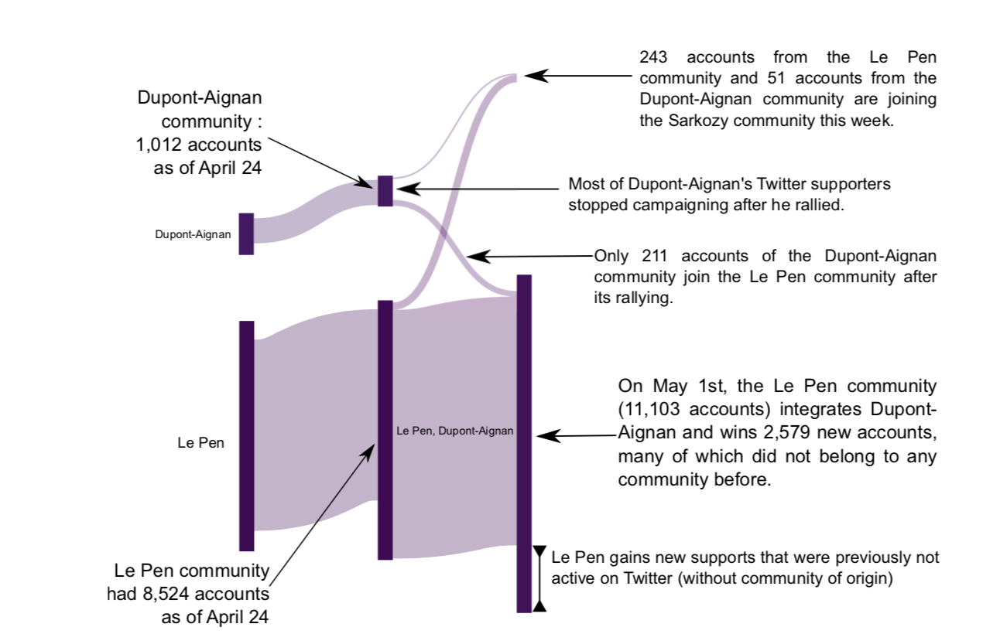

---
.left-column[
# Réseaux "évènementiel"

## Networks are not "facts"
A sum of trajectories

Comment penser les durées dans les réseaux?

## Prototypes

[Graph Events](https://github.com/clemsos/graph-events)

[Graph Query](https://github.com/topogram/graph-query)

]

.right-column[

]
---
class: inverse
## Visualiser le changement dans les réseaux géographiques

(Gao et al, 2018)

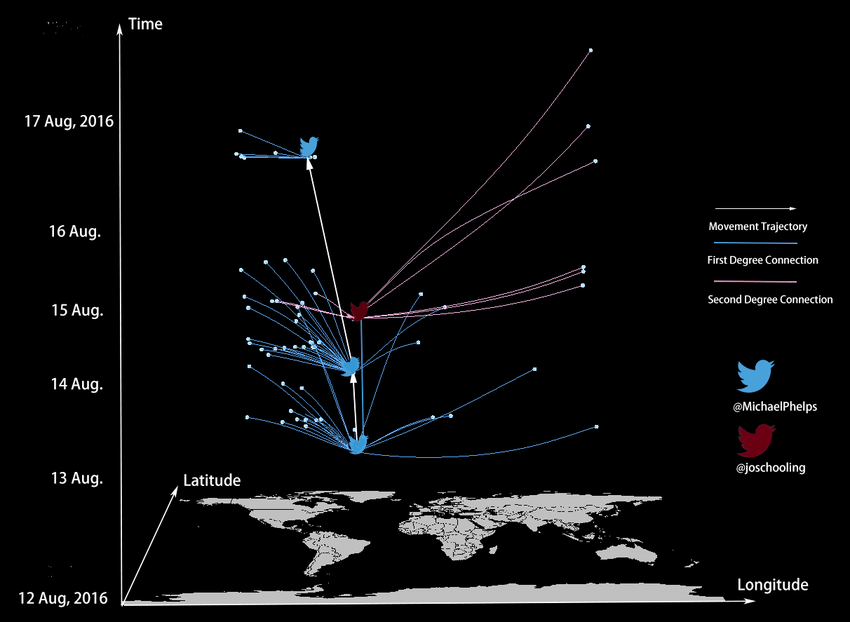

---
# Devices : tablettes et autres

[Exploding Menu](http://tillnagel.com/2011/07/exploding-menu/) (Nagel, 2010)

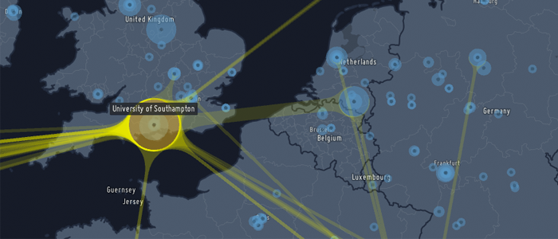
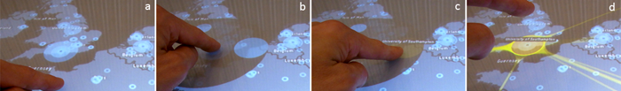

---
class: middle
# Visualisation toolkit for Internet memes

[http://clementrenaud.com/projects/phD](http://clementrenaud.com/projects/phD) (Nov 2014) - .small[[Slides](/talks/soutenance-phD/) de la soutenance]

.right-column[
**The case of the Chinese social network Sina Weibo**
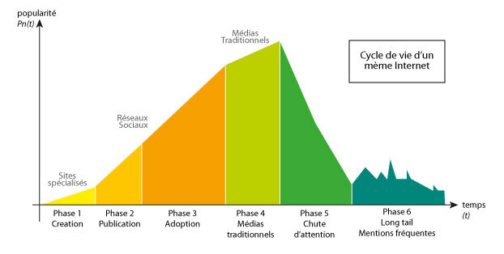

We develop a data mining and visualisation toolkit to study how the information is shared on online social network services. This software allows to observe relationships between conversational, semantical, temporal and geographical dimensions of online communication acts.
]

.left-column[

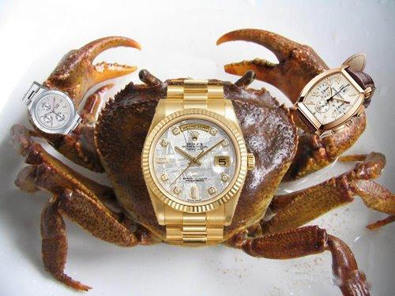

]

---
class:  center, inverse

# Economie de l'attention

.small[[Voir la vidéo](http://www.bilibili.com/video/av2023391/)]

---
class: center, middle

.footnote.small[source : Wang &al., 2012 [Competition among memes in a world with limited attention](http://www.nature.com/articles/srep00335), *Nature*]

---
# Comment observer les circulations?

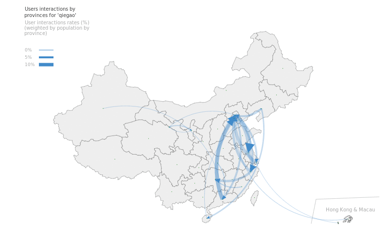

---
# Visualization toolkit for memes

.col-one-half[
### Weiboscope .small[(Fu&Chan, 2013)]

Jupyter / Python   
NLP / Pandas   
Mongo / Elastic Search

### 4 niveaux de lecture

- langagier
- conversationnel
- géographique
- temporel

### Custom interface
- stats
- zoom
- save
- compare
]

.col-one-half[

]

---
# Now : 3 yrs of painful .small[(but fun)] rewriting...

.left-column[
## 💀  [Legacy Code](http://github.com/clemsos/mitras)
iPython + d3/angular  
Elastic Search  
Use at your own risk!

## 🇨🇳 [Rewriting](https://github.com/topogram/weibo-miner-server)
Python Flask + idem      
Elastic Search  
Mining+viz of Chinese language

## 😎 [Bandstour](https://github.com/topogram/bandstour)
JS / Meteor  
2e prix Concours GeoViz St Dié  (oct 2015)
DH Benelux 16

## 🐼 [Production](https://github.com/topogram/topogram)
Meteor + React/Redux   
Github life
Maintaining!  
]

.right-column[

.small[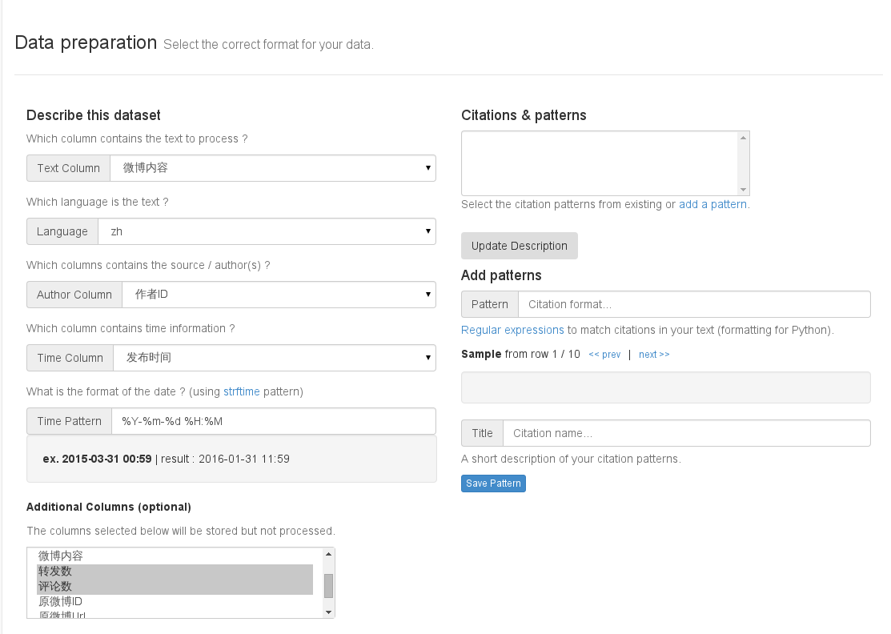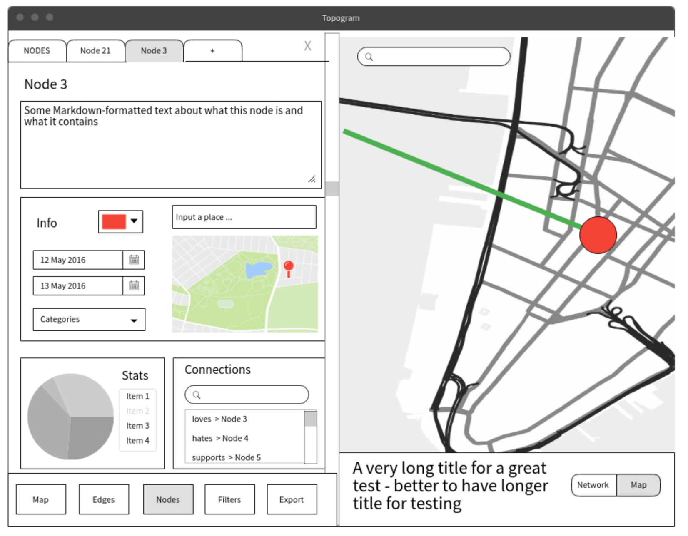]
]

---
class: inverse
background-image: url(./img/topogram-home.png)
# ... to create :

---
background-image: url(./img/screenshot-arc5-map.png)
## Cartographie d'Acteurs
### ARC5 - Recherche & Culture en région Rhône-Alpes

.footnote[
Lire la [carte](https://app.topogram.io/topograms/3Fep7oZAFjqBnHLQR), [méthodo](http://nbviewer.jupyter.org/github/clemsos/arc5/blob/master/notebooks/ARC5%20-%20M%C3%A9thodologie%20Finale.ipynb) ou voir les [slides](/talks/ARC5)
]
---
background-image: url(./img/seedvault.jpg)
class: inverse
# Topogram aujourd'hui

### The Atlas of Data on Earth

### GPN in China
### Bandstour

### Twitter viz

### etc...

---
class: inverse, middle

.col-one-half[

# Looking for maintainers !

## hi@topogram.io
]

.col-one-half[
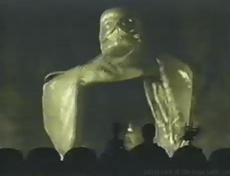
]

.footnote[
## Merci de votre attention :)

]
